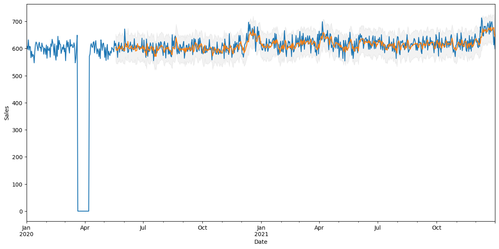

# Egg Sales Prediction
## **Introduction**
This is a time series forecasting problem. The dataset contains 30 years of egg sales data. The goal is to predict the egg sales for 2022. The dataset is provided by [Kaggle](https://www.kaggle.com/datasets/kanchana1990/egg-sales-of-a-local-shop-for-30-years/data)

---
## **Table of Contents**
1. [Problem Statement](#problem-statement)
2. [Data](#data)
3. [Model](#model)
4. [Results](#results)
5. [Conclusion](#conclusion)
6. [Reflection](#reflection)
7. [References](#references)
---

## **[Problem Statement](#problem-statement)**
Dive into the world of time series forecasting with the Egg Sales Forecasting Challenge! This competition provides a rich dataset detailing 30 years of egg sales from a Sri Lankan shop. As participants, you'll uncover the nuances of seasonal fluctuations influenced by cultural festivities, global events, and even unexpected lockdowns. Beyond just raw numbers, this dataset tells a story of traditions, market dynamics, and the resilience of businesses. Your mission? Harness this wealth of information to predict the egg sales for 2022. Whether you're a newbie in forecasting or a seasoned data scientist, this challenge offers a unique opportunity to hone your skills.

---
## **[Data](#data)**
The `train_egg_sales.csv` contains 30 years of egg sales data. The data is provided in a csv file. The data contains 2 columns: Date and Egg Sales, in the format of `Date;Egg Sales`. `test_egg_sales.csv` is test data where the sales should be forecasted.

---

## **[Model](#model)**
I'm using **Seasonal AutoRegressive Integrated Moving Average (SARIMA)** which is suitable algorithm to deal with time-series data which has seasonality. SARIMA is an extension of ARIMA that supports the direct modeling of the seasonal component of the series. It adds three new hyperparameters to specify the autoregression (AR), differencing (I) and moving average (MA) for the seasonal component of the series, as well as an additional parameter for the period of the seasonality.

---

## **[Results](#results)**
**Root Mean Squared Error (RMSE)** is **24.03167**

> Statistical Summary of the dataset  

> Correlation between features  

> Total sales across years  

> Monthly sales arranged by year  

> Forecasted sales  

---
## **[Conclusion](#conclusion)**
The model is able to predict the egg sales for 2022 with RMSE of 24.03167. The model can be improved by using other algorithms such as LSTM, Prophet, etc. I have used Dicky Fuller test to check the stationarity of the data. And used Difference method to make the data stationary. I have used different permutations of p, d, q values to find the best parameters for the model. I have used SARIMAX to train the model and forecast the sales.

---
## **[Reflection](#reflection)**
- There are many ways that I could've used to solve this problem. I could've used Prophet, XGBoost, or any other algorithms. Who knows, it might've resulted it different results.
- There is also another way I think that might improve the model accuracy. I could've used holidays as an additional feature. Use One-Hot encoding to encode the holidays i.e 0 for non-holiday and 1 for holiday. This might've atleast show us a correlation between holidays and sales. But I didn't do it because I couldn't figure out how to fetch the data.
- I've tried to use several Holiday APIs such as HolidayAPI.com, AbstractAPI.com, etc but most of them were paid and other had limitations for free users. Let me know if you know any free Holiday APIs.
---
## **[References](#references)**
These are the references I used for this notebook:
- Krish Naik's Youtube Video: https://youtu.be/2XGSIlgUBDI?feature=shared
- Bisman Preet Singh's Medium Article: https://medium.com/analytics-vidhya/predicting-sales-time-series-analysis-forecasting-with-python-b81d3e8ff03f
- Bisman Preet Singh's Github Repository: https://github.com/bisman16/Kaggle_Rossmann_Store_Sales_Forecasting/tree/master
- Hyndman, R.J., & Athanasopoulos, G. (2018) Forecasting: principles and practice, 2nd edition, OTexts: Melbourne, Australia. https://otexts.com/fpp2. Accessed on 2023-11-09
